# Power BI

[Clique aqui](https://www.youtube.com/playlist?list=PLFKhhNd35zq90tdc3PYpx4IA-SoxSNlmN) para acessar a playlist do curso **Curso de Power BI - Do Básico ao Profissional** fornecido pelo canal ** Prime Cursos do Brasil** do Youtube.

## Materiais utilizados no curso

├── Materiais

│ └── Dimensão

│   └── Canal.xlsx

│   └── Categoria.xlsx

│   └── Cidade.xlsx

│   └── Clientes.txt

│   └── Marca.xlsx

│   └── Produto.xlsx

│   └── Subcategoria.xlsx

│ └── Fato

│   └── vendas - 2010_2013.xlsx

│   └── vendas - 2014_2017.xlsx

│   └── vendas - 2018_2021.xlsx

## Importar fontes de dados

Vamos importar os dados fornecidos no diretório Materiais.

1. No diretório **Dimensão** Temos planilhas e um arquivo de texto, vamos importá-los utilizando o botão *Página Inicial / Obter Dados* e o tipo de arquivo desejado, por exemplo Excel, Texto, pasta, etc.

2. Ao importar uma planilha, recebemos o seguinte questionamento:

    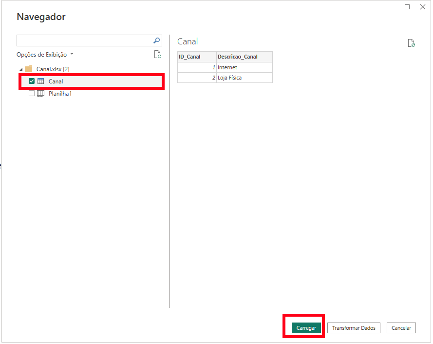

    a. A primeira opção que podemos ver na imagem, é para importar no formato de **tabela**.

    b. A segunda opção, é para importar no formato de **planilha**.

        A melhor opção é importar como tabela, diferença entre as duas é que a tabela só importa as linhas e colunas que contém dados. Já no formato de planilha irá importar as 1.048.576 linhas e 16.384 colunas do Excel, deixando a tudo mais lento.

3. Clicar em **Carregar**, a pasta *Dimensão* possui várias planilhas para importar, então é mais prático apenas carregar todas elas e transformar os dados em uma etapa posterior, mas também é possível clicar em **Transformar Dados** e realizar cada transformaçãos nessa etapa.
Após carregar todas as planilhas deste diretório, teremos a seguinte estrutura:
  
    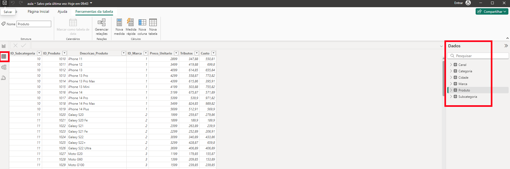

4. Atenção ao arquivo Clientes.txt, ele não é uma planilha, é um arquivo de texto com dados separados por tabulações, nesses casos, sempre devemos avaliar o arquivo para descobrir qual o seu delimitador, é tabulação, é vírgula, é ponto e vírgula, etc.

    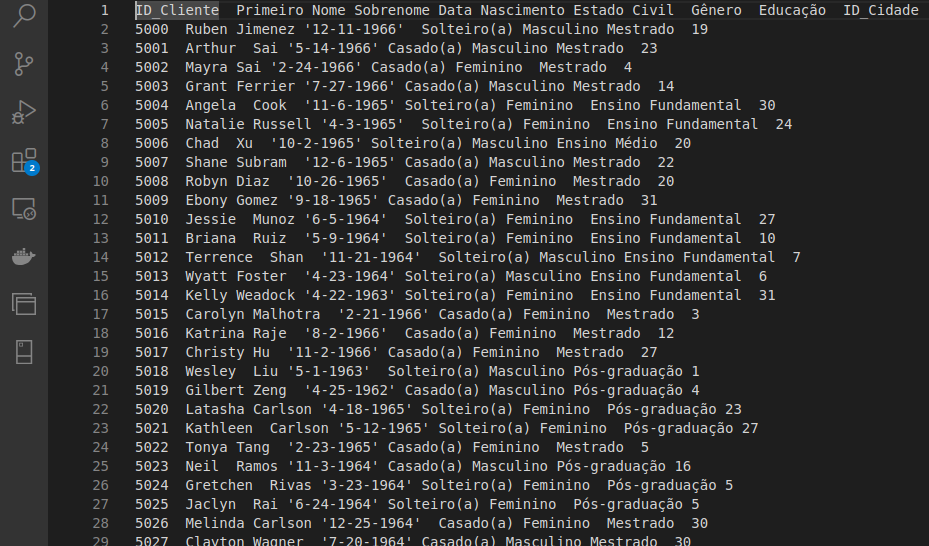
    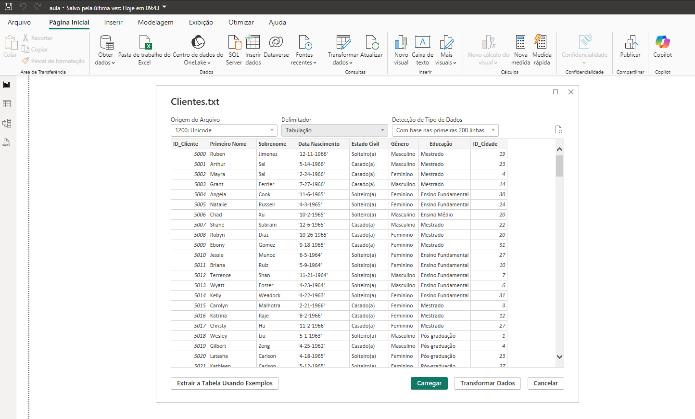

5. Clicar em *Página Inicial / Transformar dados*

    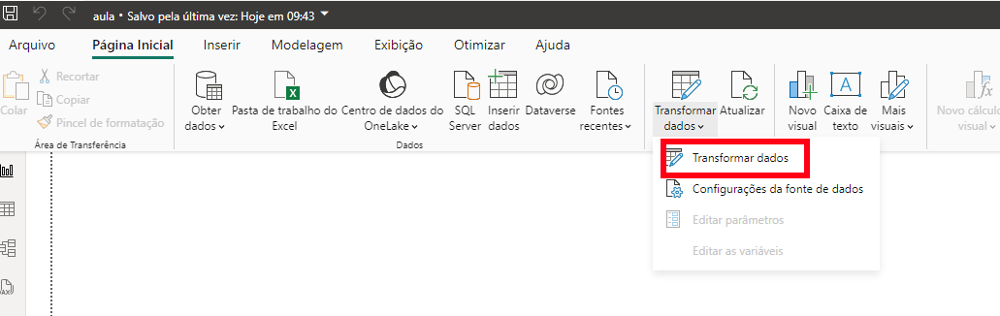

6. Na tela aberta, vamos editar os nomes das tabelas e os tipos de dados.

    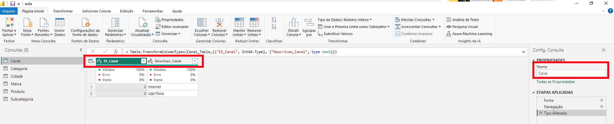

    a. Nos nomes de arquivos iremos remover acentos, espaços e caracterés especiais. Além disso, é interessante adicionar um prefíxo *dim_*, pois todos os arquivos são referentes a dimenções.
      
      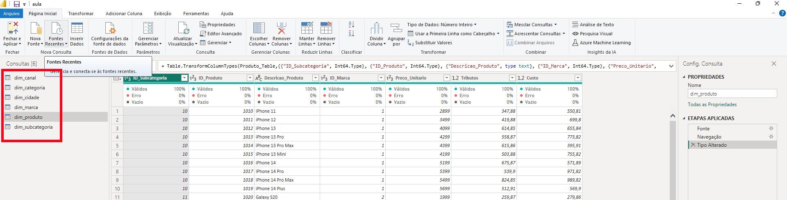
    
    b. Nos tipos de dados iremos verificar em cada tabela se o tipo está correto, para alterar basta seguir o exemplo da imagem abaixo.
      
      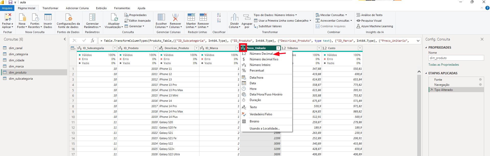

    c. Na tabela dim_cliente iremos mesclar as colunas nome e sobrenome.
      
      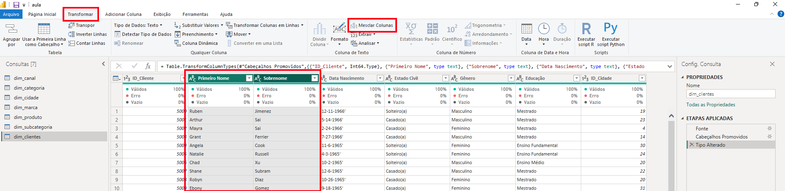
      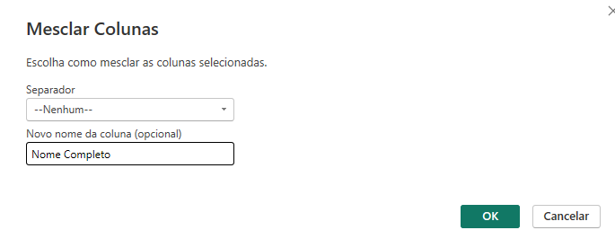

    d. Ainda na tabela dim_cliente iremos corrigir a coluna Data de nascimento, o tipo está como texto, com aspas e no formato americano (M-D-YYYY). As imagens a seguir irão mostrar o passo a passo e o resultado das transformações.
      
      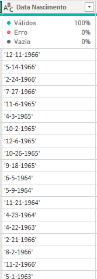
      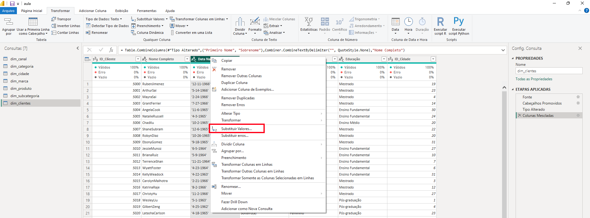
      
      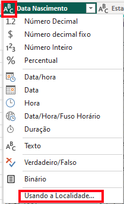
      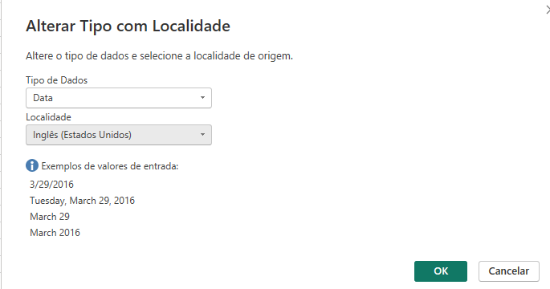
      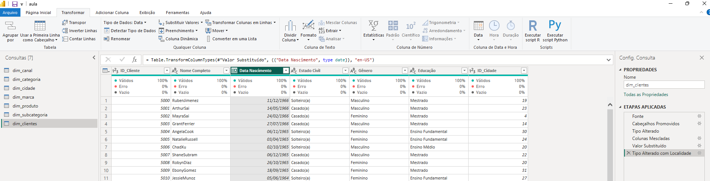

    e. Em seguida basta clicar em fechar e aplicar para salvar as transformações nas tabelas.