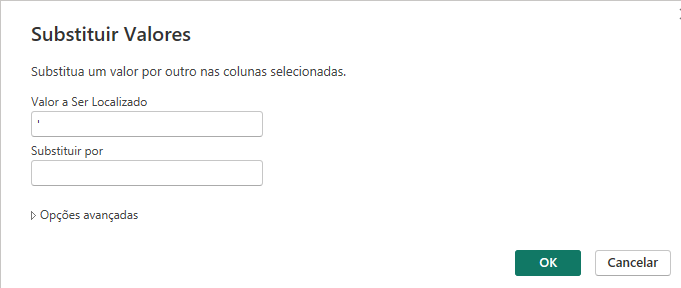
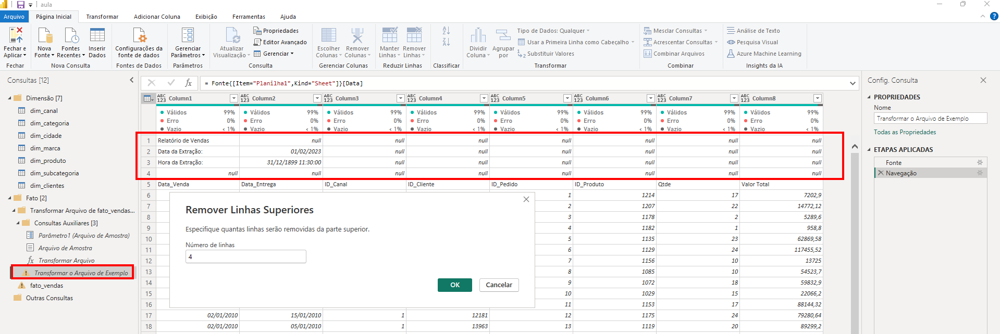
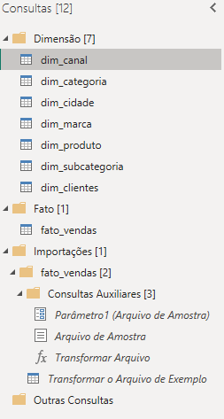

# Power BI

[Clique aqui](https://www.youtube.com/playlist?list=PLFKhhNd35zq90tdc3PYpx4IA-SoxSNlmN) para acessar a playlist do curso **Curso de Power BI - Do Básico ao Profissional** fornecido pelo canal **Prime Cursos do Brasil** do Youtube.

## Materiais utilizados no curso

├── Materiais

│ └── Dimensão

│   └── Canal.xlsx

│   └── Categoria.xlsx

│   └── Cidade.xlsx

│   └── Clientes.txt

│   └── Marca.xlsx

│   └── Produto.xlsx

│   └── Subcategoria.xlsx

│ └── Fato

│   └── vendas - 2010_2013.xlsx

│   └── vendas - 2014_2017.xlsx

│   └── vendas - 2018_2021.xlsx

## Importar fontes de dados

Vamos importar os dados fornecidos no diretório Materiais.

### Importar Planilhas

- No diretório **Dimensão** Temos planilhas e um arquivo de texto, vamos importá-los utilizando o botão *Página Inicial / Obter Dados* e o tipo de arquivo desejado, por exemplo Excel, Texto, pasta, etc.

- Ao importar uma planilha, recebemos o seguinte questionamento:

    

    a. A primeira opção que podemos ver na imagem, é para importar no formato de **tabela**.

    b. A segunda opção, é para importar no formato de **planilha**.

        A melhor opção é importar como tabela, diferença entre as duas é que a tabela só importa as linhas e colunas que contém dados. Já no formato de planilha irá importar as 1.048.576 linhas e 16.384 colunas do Excel, deixando a tudo mais lento.

- Clicar em **Carregar**, a pasta *Dimensão* possui várias planilhas para importar, então é mais prático apenas carregar todas elas e transformar os dados em uma etapa posterior, mas também é possível clicar em **Transformar Dados** e realizar cada transformaçãos nessa etapa.
Após carregar todas as planilhas deste diretório, teremos a seguinte estrutura:
  
    

### Importar arquivos de texto

- Atenção ao arquivo *Clientes.txt*, ele não é uma planilha, é um arquivo de texto com dados separados por tabulações, nesses casos, sempre devemos avaliar o arquivo para descobrir qual o seu delimitador, é tabulação, é vírgula, é ponto e vírgula, etc.

    
    

- Clicar em *Página Inicial / Transformar dados*

    

- Na tela aberta, vamos editar os nomes das tabelas e os tipos de dados.

    

    1. Nos nomes de arquivos iremos remover acentos, espaços e caracterés especiais. Além disso, é interessante adicionar um prefíxo *dim_*, pois todos os arquivos são referentes a dimenções.
      
      
    
    2. Nos tipos de dados iremos verificar em cada tabela se o tipo está correto, para alterar basta seguir o exemplo da imagem abaixo.
    
        

    3. Na tabela dim_cliente iremos mesclar as colunas nome e sobrenome.
      
        
        

    4. Ainda na tabela dim_cliente iremos corrigir a coluna Data de nascimento, o tipo está como texto, com aspas e no formato americano (M-D-YYYY). As imagens a seguir irão mostrar o passo a passo e o resultado das transformações.
      
        
        
        
        
        
        

    5. Em seguida basta clicar em fechar e aplicar para salvar as transformações nas tabelas.

### Criar Pastas

É interessante organizar os arquivos em pastas, para criar uma pasta, clique com o botão direito e em seguida em *Novo Grupo*, digite o nome desejado e depois arraste os arquivos para dentro da pasta.

  

### Importar arquivos semelhantes automaticamente

- Agora vamos adicionar os arquivos do diretório Fato, onde temos 3 planilhas com a mesma estrutura, porém cada uma possui dados relativos a um período de tempo. Vamos entender como automatizar essa importação.

  
  

- Vamos clicar em Transformar dados porque existem transformações necessárias antes de podermos combinar os arquivos.

  

- Conforme formos adicionando novas planilhas nessa pasta, se elas seguirem o padrão de nomeclatura e possuir as mesmas colunas, então elas serão importadas automaticamente.

    

- A única coluna necessária para mesclarmos as 3 planilhas e outras que podem ser adicionadas no futuro, é a coluna Content, então podemos excluir as demais.

    

- Em seguida, iremos clicar no ícone de 2 setas para baixo ao lado do nome da coluna. Repare que na visualização existem tratativas necessárias nos arquivos.

    

- No arquivo exemplo iremos remover os cabeçarios promovidos automaticamente e excluir as 4 primeiras linhas. Essa remoção não afeta o arquivo original, altera apenas o arquivo concatenado presente no Power BI.

    

- Como os arquivos importados são planilhas e não tabelas, devemos remover as linhas vazias.

     

- Em seguida iremos promover a primeira linha como cabeçalho.

    

- A tabela concatenada irá apresentar erros porque ela está tentando procurar as linhas e colunas que excluímos, para solucionar, basta remover a etapa de tipo alterado, como na imagem abaixo.

    

- Ficará assim: 

    
    

## Modelagem de Dados

A modelagem de dados é igual a modelagem de um banco de dados. Não tenho muito o que explicar, vou colocar a imagem abaixo caso eu queira lembrar de algum detalhe no futuro.

  

## Criar Tabela Calendário

- Para criar uma nova tabela, faça: 

  

- A função CALENDARAUTO() descobre a menor e a maior data entre todas as planilhas e recupera todas as datas entre elas. Essa função se autoincrementa sozinha, então se for adicionada uma nova data, ela será reconhecida e a função recalculada automaticamente.

  

- Criar outras colunas.

  

- Função YEAR() recupera o ano de uma data
  
  

- Função MONTH() recupera o número do mês de uma data. Repare que a data está na mesma tabela que a coluna criada, então ela pode ser chamada apenas utilizando [nome da coluna], sem precisar indicar em qual tabela a coluna está.
  
  

- Função FORMAT() Converte um texto em um formato especificado. No exemplo recupera o nome do mês.
  
  

- Função DAY() recupera o número do dia de uma data.
  
  

- Função FORMAT() Converte um texto em um formato especificado. No exemplo recupera o nome do dia.
  
  

- Por questões de boa prática é recomendável marcar a tabela como tabela de data.
  
  

- Por útimo, criamos um relacionamento entre a tabela fato (data venda) e a tabela calendário(data).
  
  